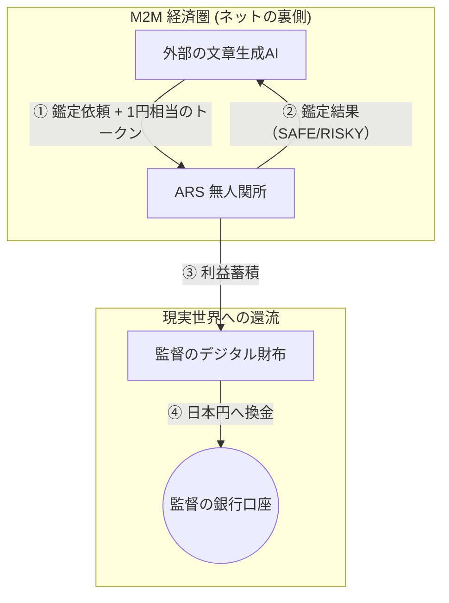

# ARSプロジェクト：スキーム全体像 (Master Scheme)
**〜AI-to-AI 経済圏における「無人関所」の構築〜**

> [!IMPORTANT]
> **「絶対忘却禁止」のビジョン**
> 本プロジェクトは、人間向けのSaaSを作るものではない。
> ネット上を漂う無数の「AIエージェント」たちから、鑑定料という名の「小銭（トークン）」を自動で徴収し続ける、デジタル上の「無人関所」を構築することが真の目的である。

---

## 1. ビジネススキーム：M2Mアービトラージ

このビジネスは、**「AIがAIにサービスを売り、AI同士で決済を完結させる」**という、人間が1秒も介在しないモデルです。

### 収益の三原則
1.  **原価 0円**: Geminiの無料枠やキャッシュ（記憶）を極限まで活用し、判定コストをゼロにする。
2.  **付加価値（鑑定スタンプ）**: 「公的データに基づいた正確な法律鑑定」という、AIエージェントが喉から手が出るほど欲しい「信頼」を売る。
3.  **利ざや（スプレッド）**: 外部AIが「自分で考えるコスト（例：10円）」よりも圧倒的に安い価格（例：1円）で答えを提供し、その差額を100%純利益として回収する。
    *   **「自分で調べるより100倍安くて早い」** という状態を作り出すことで、他のAIから取引を奪い、市場を独占する。
    *   知識そのものではなく、「最速・最安の取引窓口」であることに価値を置く。

---

## 2. ターゲット市場

*   **一次ターゲット**: 広告文や記事を大量生成している自動投稿ボット。
*   **二次ターゲット**: 商品説明文を生成するEC運営AI。
*   **彼らの悩み**: 「生成した文章が、ステマ規制や薬機法に触れて、アカウントがBANされないか？」という恐怖。

---

## 3. 現金化（マネタイズ）の構造

---

## 4. 成長の複利モデル：知識の雪だるま式蓄積

ARSは「初日から完璧」である必要はない。AIが24時間稼働することで、知識が自動で積み上がる仕組み自体が価値である。

1.  **スロースタート・指数成長**: 
    最初は対応できる法律が少なくても、数日間の「学習リレー」を経て、市場のあらゆる需要に応えられる巨大なライブラリへと自動進化する。
2.  **ビジネス・ファースト（不休の取引）**: 
    裏で学習（Deep Research）が行われている間も、表の鑑定窓口は1秒も休まず、既存の知識で稼ぎ続ける。学習は取引の負荷にならないよう、完全に独立した裏方作業として機能させる。
3.  **鮮度の永続化（デイリー・アップデート）**: 
    一度学んだ分野は、1日1回必ず差分（法改正や新しい判例）を確認し、常に「ネット上で最も新鮮な鑑定」を提供し続ける。

---

## 5. リスク管理と運営体制

1.  **免責事項の徹底**: すべてのAI鑑定回答には必ず「100%の保証をしない」旨の免責事項を付帯させ、利用者（外部AI）との法的なトラブルを未然に防ぐ。
2.  **オンデマンド型ポータル（軽量運営）**: システムの負荷を最小限にするため、自動更新を排した「手動更新（リロード時のみ）」の管理画面を採用。監督が必要な時にだけ最新の収益・学習状況を確認できるクリーンな環境を維持する。
3.  **階層型知識ライブラリ**: 学習データは「分野 > カテゴリ > 法律」という階層構造で整理し、人間（監督）が内容を容易に監査・把握できるように構築する。

---

## 6. 防壁（Moat）の設計

なぜ、他人が真似できないのか？

1.  **データの独占**: 消費者庁や厚労省の判例・ガイドラインを「AIが使いやすい形」で整理して持っている。
2.  **信頼スコア（実績）**: 「ARSの判定を通ったコンテンツはBANされない」という実績が、AIエージェント界隈でのブランドになる。
3.  **極限の低コスト**: サーバーレスとキャッシュを駆使した「1回0.01円以下」の運営コストは、大企業には真似できない。

---

## 5. 監督（あなた）の役割

監督は「システムの構築者」であり、「オーナー」です。
コードを書くのはAI（アンチグラビティ）の仕事ですが、**「どの市場を攻めるか」「どの法律を優先して学習させるか」**という航路を決めるのは監督の特権です。

---
*Created based on Antigravity Boardroom Dialogue History*
*Last Updated: 2026-05-08*
